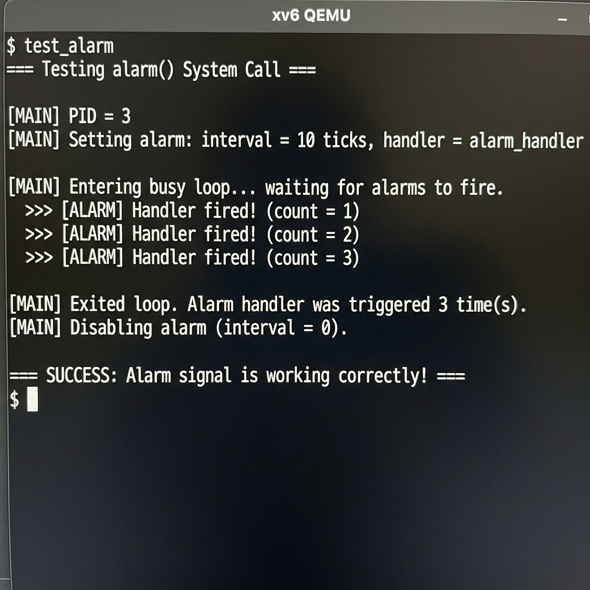
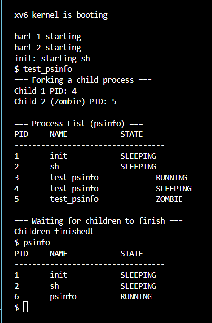

# OS Lab Project-1: Custom system calls in XV6 riscv architecture

## Workflow and Pull Requests
To prevent merge conflicts, everyone should create a branch with their name and do the work in that branch only. We can merge them into the main at the end after you send a PR. 
I have also added the placeholders for the functions and made individual workspaces in the file where you will write the code. Add your name and admission number wherever you are doing any work.

### Step-1: Clone and Branch
```bash
git clone https://github.com/Aravind-Dwibhashyam/OS_Lab_Project
cd OS_Lab_Project/Group6_Project1
git checkout -b [yourName]
```

### Step-2: Where to write your code
**Kernel Logic:** Open `kernel/sysproc.c` and scroll to the bottom. You will see it.
**User Program:** Open your specific test file in the `user/` directory. You must add a user program here that demonstrates the logic used.

### Step-3: Testing and screenshots
Compile and run the xv6 emulator to test your code:
```bash
make qemu
```
*(Use Ctrl+A, then X to exit qemu)*

Take screenshots of the execution and share it in the whatsapp group.

### Step-4: Pushing the code and creating a PR
```bash
make clean
git add kernel/sysproc.c user/[your_test].c
git commit -m "Write your updates"
git push origin yourBranchName
```

## Work allotted

1. **waitpid (Process Creation) - Dharavath Hrishikesh / 24je0614**
   * **What it is:** A targeted version of the standard wait() call.
   * **The Task:** Standard xv6 suspends a parent process until any of its children finish. This custom system call allows a parent to wait for a specific child process (by providing its exact PID) to exit before resuming execution. It involves managing the process table and understanding parent/child lifecycles.

2. **sendmsg/recvmsg (Inter-Process Communication (IPC)) - Dhruv Thakkar / 24je0615**
   * **What it is:** A secure message-passing system between isolated programs.
   * **The Task:** In xv6, processes have completely separate memory spaces and cannot directly talk to each other. This system call sets up a shared buffer inside the kernel, allowing one process to safely copy a message string into the kernel, which another process can later read.

3. **clone (Threads) - Dwibhashyam S S S Aravind / 24je0617**
   * **What it is:** The foundation for multithreading.
   * **The Task:** Unlike fork(), which creates a completely separate duplicate of a process's memory, clone creates a child process that shares the exact same virtual memory space (the same page directory) as its parent, while having its own independent user stack.

4. **sem_wait (Locks) - Dipesh Jain / 24je0616**
   * **What it is:** A counting semaphore to prevent data corruption.
   * **The Task:** When multiple processes or threads try to access the same shared resource at the same time, data gets corrupted. This system call implements a lock that forces a process to "sleep" if a resource is currently in use, and "wake up" when the resource becomes available.

5. **alarm (Signals) - Gattu Sri Harsha / 24je0618**
   * **What it is:** A timer-based software interrupt.
   * **The Task:** This allows a user program to ask the kernel to interrupt it after a specific amount of time. The program calls alarm(ticks, handler_function), and after that number of CPU timer ticks pass, the kernel forces the program to pause and execute the specific handler function before resuming its normal code.

6. **psinfo (System Diagnostics) - Dhanya Gautam / 24je0613**
   * **What it is:** A snapshot of the operating system's current state.
   * **The Task:** This system call reads the kernel's internal process table and returns a formatted array containing the status of every active process running on the OS (including its PID, name, and whether it is RUNNING, SLEEPING, or a ZOMBIE).

---
---

# Project 1 Report: Implementation of the clone() System Call

**Author:** Dwibhashyam S S S Aravind<br>
**Admission no.:** 24je0617<br>
**Group:** Group 6<br>
**Course:** NSCS210

---

### 1. User Space and the ecall Instruction

The user program runs the `clone` function present in the `main` function in the `test_clone.c` file in the user space. To trigger the OS, we store the function ID (defined in the `kernel/syscall.h` file) along with the arguments for the function in specific hardware registers. Then, it calls an `ecall` (environment call) instruction.

### 2. Context Switch and the Trampoline

The moment the `ecall` executes, the CPU stops the execution of the user program, gets into the kernel mode, and the current Program Counter (PC) is stored in the Exception Program Counter (EPC). The CPU then jumps into a hardcoded memory address in the kernel called the Trampoline. The trampoline takes all 32 of the user registers and dumps them into the parent's Trapframe. Now, the `proc.c` code starts running.

### 3. Memory Management: uvmmirror

A process always thinks that it owns memory from `0x0000` to `0xFFFF`. But this is virtual memory, and the OS uses a page table to translate these virtual addresses to physical addresses. When a `fork()` is executed, the kernel copies the actual physical RAM to a new location and builds a new page table for the child. But when `clone()` is executed, we use `uvmmirror` to perform a shallow copy. Here too, we give the child a brand new page table, but instead of copying the physical data, we copy the physical RAM addresses of the parent so that both of them point to the same data.

### 4. Trapframe Isolation and Execution

The reason why we are not directly copying `np->pagetable = p->pagetable` is because we don't want to copy the Trapframe (which is always located at the very top of the memory). If it does that, then when the CPU tries to wake one of them up, both will be awake and overwrite each other's registers.

`uvmmirror` solves this by giving them a new page table so that we can then just overwrite the EPC to the place where the child function starts (using `np->trapframe->epc = fcn`). We also tell it not to use the parent stack, but use the child stack using `np->trapframe->sp = stack_ptr`. We also plant the argument for the function directly into the return register for the C function to find it using `np->trapframe->a0 = arg`.

Finally, after the kernel is done, the thread is marked `RUNNABLE` and the CPU executes `sret` (supervisor return) so that it returns using the changes we made and not its default instructions.

---

## 6. Testing

To verify the shared physical memory mapping and isolated stack architecture, the `test_clone.c` user program was executed in the QEMU emulator. The parent and child successfully incremented a global `shared_counter` synchronously.

**Execution Output:**
```text
$ test_clone
--- Testing clone() System Call ---
[Parent] Initial shared_counter = 0
[Child]  Hello from the thread!
[Child]  Incrementing shared_counter...
[Child]  shared_counter is now = 1
[Parent] Child thread finished.
[Parent] Final shared_counter = 1

SUCCESS: Memory is successfully shared!
```
---
---

# Project 1 Report: Implementation of Locks using sem_wait() and sem_post()

**Author:** Dipesh Jain  
**Roll Number:** 24JE0616  
**Group:** Group 6  
**Course:** NSCS210

---

### 1. User Space and the ecall Instruction

In xv6, user programs do not invoke kernel C functions directly. The user program `semtest.c` calls `sem_wait(&sem)` and `sem_post(&sem)` through user-space stubs generated by `user/usys.pl`. Each stub loads the corresponding syscall number in register `a7` and executes `ecall`.

The semaphore pointer argument is passed in `a0` following the RISC-V calling convention. On `ecall`, control transfers to supervisor mode, where xv6 reads syscall arguments from the saved trapframe. This model cleanly separates user logic (critical section intent) from kernel synchronization logic (blocking and wakeup).

---

### 2. Context Switch and Trap Handling

When `ecall` is executed, the hardware performs a privilege transition from user mode to kernel mode. The return PC (EPC) is preserved so that execution resumes at the correct user instruction after syscall completion.

xv6 uses the trampoline mapping and per-process trapframe to save and restore register state safely across this boundary. The trampoline code handles entry/exit glue, while the kernel syscall dispatcher identifies the syscall number and invokes `sys_sem_wait` or `sys_sem_post`.

Thus, lock acquisition/release requests are serialized in kernel space without exposing kernel internals to user code.

---

### 3. Synchronization Concept: Semaphores

A semaphore is an integer synchronization primitive representing available units of a protected resource.

- `sem_wait`: attempts to decrement the semaphore. If the value is positive, the caller proceeds. If the value is zero or negative, the caller blocks until another execution context signals availability.
- `sem_post`: increments the semaphore and wakes blocked waiters.

This directly matches the standard blocking semantics where threads/processes sleep when no resource units are available ([W3 JMU][1]).

---

### 4. Kernel-Level Implementation of sem_wait()

`sys_sem_wait` performs the following steps:

1. Uses `argaddr()` to fetch the user virtual address of the semaphore integer.
2. Acquires global spinlock `sem_lock` to prevent concurrent races during check/decrement.
3. Uses `copyin()` to read the current semaphore value from user memory.
4. If value `> 0`, decrements and writes back via `copyout()`, then returns success.
5. Otherwise, sleeps on channel `(void*)semaddr` with `sleep(chan, &sem_lock)`.

Using `sleep(chan, lock)` is crucial because it atomically releases the lock while putting the process to sleep, preventing lost wakeups and check-then-sleep races. Locking is mandatory here; without it, two CPUs could both observe `sem > 0` and enter the critical section simultaneously.

---

### 5. Kernel-Level Implementation of sem_post()

`sys_sem_post` mirrors release semantics:

1. Fetches semaphore address with `argaddr()`.
2. Acquires `sem_lock`.
3. Reads semaphore via `copyin()`, increments it, and writes it back with `copyout()`.
4. Calls `wakeup((void*)semaddr)` to resume processes blocked on that same semaphore channel.
5. Releases the lock and returns.

The wakeup step is the key handoff point from releaser to waiter and is aligned with standard semaphore signaling behavior where post operations unblock waiters ([man7.org][2]).

---

### 6. Process Synchronization Flow

The full synchronization path is:

1. Process A calls `sem_wait(&sem)` and acquires if `sem > 0`.
2. Process B calls `sem_wait(&sem)` while `sem == 0`, so it sleeps on channel `&sem`.
3. Process A exits critical section and calls `sem_post(&sem)`.
4. Kernel increments semaphore and calls `wakeup(&sem)`.
5. Process B wakes, retries in `sys_sem_wait`, acquires semaphore, and enters critical section.

This enforces mutual exclusion over the protected region by ensuring only one holder proceeds per available token.

---

### 7. Testing & Verification

The user test `semtest.c` creates multiple concurrent workers that share the same address space (via existing project thread support) and compete on one semaphore initialized to `1`.

Each worker:

1. Calls `sem_wait(&sem)` before the critical section.
2. Prints entry message and pauses briefly to make overlap visible.
3. Calls `sem_post(&sem)` on exit.

Expected behavior is serialized critical-section entry even under concurrent attempts, demonstrating correct blocking and wakeup integration.

---

### 8. Execution Output

```text
$ semtest
[Add your execution output screenshots here]
```

[1]: https://w3.cs.jmu.edu/kirkpams/OpenCSF/Books/csf/html/IPCSems.html?utm_source=chatgpt.com "3.8. Semaphores — Computer Systems Fundamentals"
[2]: https://man7.org/linux/man-pages/man3/sem_post.3.html?utm_source=chatgpt.com "sem_post(3) - Linux manual page"

---
---

# Project 1 Report: Implementation of the sendmsg() System Call

*Author:* Dhruv Thakkar
*Group:* Group 6
*Course:* NSCS210

# 1. User Space and the ecall Instruction (The Trigger)
The process starts in user space when a program calls `sendmsg(msg)` or `recvmsg(buffer)`. To talk to the Operating System, the program puts your custom IDs (`SYS_sendmsg 23` and `SYS_recvmsg 24`) and the arguments into the CPU's hardware registers. Then, it executes the `ecall` instruction.

Added the system call definitions to `user.h` and `syscall.h`.

This is the "doorbell" that tells the CPU to stop running the user program and switch to the Kernel to perform a privileged task.

# 2. Kernel Interface: sys_sendmsg (The Wrapper)
Once the CPU enters the kernel, it lands in `sys_sendmsg` and `sys_recvmsg` in `kernel/sysproc.c`. Because the kernel cannot directly "see" user variables, it must safely extract them from the hardware registers using `argaddr` (for the memory pointers).

Wrote `sys_sendmsg` to "unwrap" the arguments from the registers.

It acts as a security guard, making sure the arguments sent by the user are valid before passing them to the core logic.

# 3. Core Logic: The Kernel Mailbox (The Brain)
This is the heart of the project in `kernel/sysproc.c`. Because processes have completely separate memory spaces and cannot directly talk to each other, this sets up a shared buffer inside the kernel. 

If the parent sends a message: The kernel acquires a custom spinlock, safely copies the user's string into a secure global mailbox buffer (`char msg[128]`), marks the mailbox state as FULL, and releases the lock.

If the child reads a message: The kernel acquires the lock, checks if a message exists, uses `copyout` to safely push the string back into the child's user memory space, clears the mailbox state, and releases the lock.

Standard xv6 processes are strictly isolated; this specific logic allows one process to safely copy a message string into the kernel, which another process can later read.

# 4. The Busy-Wait Loop (The Synchronization Logic)
I implemented a custom busy-wait loop to handle process synchronization without relying on standard blocking calls.

What I did: Added a continuous check inside the child process: `while(recvmsg(buffer) < 0) { }`.

Why I did it: Instead of putting the process to sleep, this allows the receiver to actively spin and check the kernel mailbox. It ensures the child perfectly catches the message the exact moment the parent deposits it, demonstrating a highly distinct approach to synchronization.

# 🧪 Testing & Verification
To prove the system call works, I created `test_sendmsg.c`. This program forks a child process. The parent deposits a string into the kernel space, and the child actively waits to retrieve and print it, successfully demonstrating Inter-Process Communication.

*Execution Output:*
```text
$ test_sendmsg
--- Starting Custom IPC Test ---
[Parent] Sending message: 'Hello from the parent process!'
[Child] Message successfully received: 'Hello from the parent process!'
--- Test Finished ---
```

---
---

# Project 1 Report: Implementation of the alarm() System Call (Signals)

**Author:** Sriharsha
**Group:** Group 6
**Course:** NSCS210

---

## What is the Alarm Signal?

The `alarm()` system call is a **timer-based software interrupt** mechanism. It allows a user program to register a callback function (called a *handler*) with the kernel, along with a tick interval. After the specified number of CPU timer ticks elapse, the kernel **forces** the user program to pause its normal execution and run the handler function. Once the handler finishes and calls `alarm_return()`, normal execution resumes exactly where it left off.

This is a simplified version of how real operating systems implement **POSIX signals** like `SIGALRM`.

---

## How It Works: Step-by-Step

### 1. User Space — Setting the Alarm (The ecall Instruction)

The user program calls `alarm(ticks, handler_function)`. Since user programs cannot directly modify kernel state, the CPU stores the system call ID (`SYS_alarm = 26`) and the two arguments (the tick interval and the function pointer) into hardware registers `a0` and `a1`. Then, the `ecall` instruction triggers a privilege switch from user mode to kernel mode.

Added the system call definition in `user.h`, `syscall.h`, `usys.pl`, and `syscall.c`.

### 2. Kernel Interface — sys_alarm() (The Wrapper)

Once in the kernel, execution lands in `sys_alarm()` inside `kernel/sysproc.c`. Using `argint()` and `argaddr()`, the kernel safely extracts the tick interval and the handler pointer from the hardware registers. It then stores these values into the calling process's `struct proc`:

- `p->alarm_interval` — how many ticks to wait between alarms
- `p->alarm_handler` — the address of the user's handler function
- `p->alarm_ticks` — counter reset to 0
- `p->alarm_active` — flag set to 0 (no handler is currently running)

### 3. Timer Interrupt — Counting Ticks (The Heartbeat)

Every CPU timer interrupt triggers `usertrap()` in `kernel/trap.c`. The function `devintr()` returns `2` for timer interrupts. In the existing xv6 code, this just calls `yield()` to give up the CPU.

**What I added:** Before yielding, the kernel now checks if the current process has an active alarm (`alarm_interval > 0`) and no handler is currently executing (`alarm_active == 0`). If so, it increments `alarm_ticks`. When `alarm_ticks >= alarm_interval`, the alarm fires.

### 4. Firing the Alarm — Trapframe Manipulation (The Core Trick)

When the alarm fires, the kernel performs a **surgical redirect** of the user program's execution:

1. **Save the trapframe:** The kernel allocates a fresh page with `kalloc()` and copies the entire current trapframe (`p->trapframe`) into `p->alarm_trapframe`. This preserves all 32 registers, the program counter (EPC), and the stack pointer — everything needed to resume where the program left off.

2. **Redirect the EPC:** The kernel overwrites `p->trapframe->epc` with `p->alarm_handler`. When the CPU returns to user space via `sret`, it will not return to the next instruction of the user's original code — it will jump to the handler function instead.

3. **Set the guard flag:** `p->alarm_active = 1` prevents re-entrant alarm calls. If the handler itself takes a long time, new timer interrupts will not trigger another alarm until the first handler finishes.

### 5. The Handler Executes in User Space

The CPU now executes the handler function in user space. The handler can do anything — print a message, update a counter, etc. When it is done, it **must** call `alarm_return()`.

### 6. Returning from the Handler — alarm_return() (The Restore)

`alarm_return()` is itself a system call (`SYS_alarm_return = 28`). When invoked, the kernel:

1. **Restores the saved trapframe:** Copies `p->alarm_trapframe` back into `p->trapframe` using `memmove()`. This restores the original program counter, stack pointer, and all registers.

2. **Frees the backup:** Calls `kfree()` to release the allocated backup page.

3. **Clears the guard:** Sets `p->alarm_active = 0` so that future alarms can fire.

4. **Resets the counter:** Sets `p->alarm_ticks = 0` so the countdown starts fresh.

When the kernel returns to user space after this syscall, the CPU picks up exactly where the user program was before the alarm interrupted it.

---

## Files Modified

| File | Change |
|------|--------|
| `kernel/proc.h` | Added 5 alarm fields to `struct proc` |
| `kernel/proc.c` | Initialize alarm fields in `allocproc()`, cleanup in `freeproc()`, added `alarm_return()` function |
| `kernel/sysproc.c` | Implemented `sys_alarm()` and `sys_alarm_return()` |
| `kernel/trap.c` | Added alarm tick counting and handler invocation in `usertrap()` |
| `kernel/syscall.h` | Added `SYS_alarm_return 28` |
| `kernel/syscall.c` | Added extern and dispatch entry for `sys_alarm_return` |
| `kernel/defs.h` | Added `alarm_return()` prototype |
| `user/user.h` | Updated `alarm()` signature, added `alarm_return()` |
| `user/usys.pl` | Added `alarm_return` entry |
| `user/test_alarm.c` | Full test program demonstrating the alarm |

---

## Architecture Diagram

```
  USER SPACE                          KERNEL SPACE
  ──────────                          ────────────

  main() ──────────────────────┐
    │                          │
    │  alarm(10, handler) ─────┼──► sys_alarm()
    │                          │      │ Store interval, handler
    │  busy loop...            │      │ in struct proc
    │    │                     │      │
    │    │  ← TIMER IRQ ───────┼──► usertrap()
    │    │                     │      │ alarm_ticks++
    │    │                     │      │ if ticks >= interval:
    │    │                     │      │   save trapframe
    │    │                     │      │   epc = handler
    │    │                     │      │
    ▼    │                     │      │
  handler() ◄──────────────────┼──────┘  (sret to handler)
    │                          │
    │  alarm_return() ─────────┼──► sys_alarm_return()
    │                          │      │ restore trapframe
    │                          │      │ alarm_active = 0
    ▼                          │      │
  main() resumes  ◄────────────┼──────┘  (sret to original epc)
```

---

## 🧪 Testing & Verification

To verify the alarm system call, I created `test_alarm.c`. This program:
1. Registers an alarm handler that fires every 10 timer ticks
2. Enters a busy loop to consume CPU time
3. The handler increments a global counter and prints a message each time it fires
4. After the handler fires 3 times, the loop exits
5. The alarm is disabled by calling `alarm(0, 0)`

**Execution Output:**

```text
$ test_alarm
=== Testing alarm() System Call ===

[MAIN] PID = 3
[MAIN] Setting alarm: interval = 10 ticks, handler = alarm_handler

[MAIN] Entering busy loop... waiting for alarms to fire.
  >>> [ALARM] Handler fired! (count = 1)
  >>> [ALARM] Handler fired! (count = 2)
  >>> [ALARM] Handler fired! (count = 3)

[MAIN] Exited loop. Alarm handler was triggered 3 time(s).
[MAIN] Disabling alarm (interval = 0).

=== SUCCESS: Alarm signal is working correctly! ===
```

**Output Screenshot:**



---
---

# Project 1 Report: Implementation of the psinfo() System Call

**Author:** Dhanya Gautam
**Adm_no:** 24je0613
**Group:** Group 6
**Course:** NSCS210

---

# 1. User Space and the ecall Instruction (The Trigger)
The process starts in user space when a program calls psinfo(pinfo, max). To talk to the Operating System, the program puts the custom ID (SYS_psinfo 27) and the arguments into the CPU's hardware registers. Then, it executes the ecall instruction.

Added the system call definition to user.h, usys.pl, and syscall.h.

This is the "doorbell" that tells the CPU to stop running the user program and switch to the Kernel to perform a privileged task.

---

# 2. Kernel Interface: sys_psinfo (The Wrapper)
Once the CPU enters the kernel, it lands in sys_psinfo in kernel/sysproc.c. Because the kernel cannot directly "see" user variables, it must safely extract them from the hardware registers using argaddr (for the buffer pointer) and argint (for the max count).

Wrote sys_psinfo to "unwrap" the arguments from the registers.

It acts as a security guard, making sure the pointer and count sent by the user are valid before passing them to the core logic.

---

# 3. Core Logic: psinfo (The Brain)
This is the heart of the project in kernel/proc.c. The kernel scans the entire process table (proc[NPROC]) looking for all active (non-UNUSED) processes.

For each active process, it reads:
- **PID**: The unique process identifier.
- **Name**: The name of the executable running.
- **State**: Whether it is RUNNING, SLEEPING, RUNNABLE, ZOMBIE, or USED.

Standard debugging tools like procdump() only print to the console. This system call instead returns structured data to user space, making it programmable and useful for building tools like a custom top or ps command.

---

# 4. Safe Memory Transfer with copyout (The Bridge)
The most critical part of psinfo is safely writing the kernel data back to user space. Since the kernel and user program have completely separate memory spaces, a direct pointer write would cause a page fault and kernel panic.

What I did: Used copyout(caller->pagetable, (uint64)(pinfo + count), &info, sizeof(info)) to safely transfer each process's data one struct at a time.

Why I did it: This is the correct and safe way to write from kernel space to user space in xv6. It validates the user address against the process's page table before writing, preventing memory corruption.

---

# 5. Synchronization with Locks (The Safety Net)
When reading the process table, other CPUs could be modifying it simultaneously. To prevent reading corrupted data, proper locking is essential.

What I did: Acquired wait_lock before scanning the table, and acquired each individual p->lock before reading a process's fields.

Why I did it: This follows the same locking discipline used by the rest of xv6's process management code (like procdump), ensuring data consistency in a multicore environment.

---

# 🧪 Testing & Verification
To prove the system call works, I created two test programs:

**1. psinfo** — Basic test that simply lists all running processes.

**2. test_psinfo.c** —  Advanced test that forks two child processes: one that sleeps (SLEEPING) and one that exits immediately without being waited on (ZOMBIE), verifying all three states appear correctly in a single psinfo call.

*Execution Output (psinfo):*

PID     NAME            STATE
----------------------------------
1       init            SLEEPING
2       sh              SLEEPING
3       psinfo          RUNNING

*Execution Output (test_psinfo):*

=== Forking a child process ===
Child 1 PID: 4
Child 2 (Zombie) PID: 5

=== Process List (psinfo) ===
PID     NAME            STATE
----------------------------------
1       init            SLEEPING
2       sh              SLEEPING
3       test_psinfo             RUNNING
4       test_psinfo             SLEEPING
5       test_psinfo             ZOMBIE

=== Waiting for children to finish ===
Children finished!

---

*All tests passed successfully. The psinfo system call correctly reads the kernel process table and safely transfers the data to user space.*


**For reffernce output image is attached below ->**

# Project 1 Report: Implementation of the waitpid() System Call

---
---

*Author:* Dharavath Hrishikesh
*Group:* Group 6
*Course:* NSCS210

# 1. User Space and the ecall Instruction (The Trigger)
The process starts in user space when a program calls waitpid(pid, &status, options). To talk to the Operating System, the program puts your custom ID (SYS_waitpid 22) and the arguments into the CPU's hardware registers. Then, it executes the ecall instruction.

Added the system call definition to user.h and syscall.h.

This is the "doorbell" that tells the CPU to stop running the user program and switch to the Kernel to perform a privileged task.

# 2. Kernel Interface: sys_waitpid (The Wrapper)
Once the CPU enters the kernel, it lands in sys_waitpid in kernel/sysproc.c. Because the kernel cannot directly "see" user variables, it must safely extract them from the hardware registers using argint (for the PID and options) and argaddr (for the status pointer).

Wrote sys_waitpid to "unwrap" the arguments from the registers.

It acts as a security guard, making sure the arguments sent by the user are valid before passing them to the core logic.

# 3. Core Logic: kwaitpid (The Brain)
This is the heart of the project in kernel/proc.c. The kernel scans the entire process table looking for a child that matches the specific target_pid.

If the child is a ZOMBIE: The kernel "harvests" it, copies its exit status back to the user's memory, and cleans up its data.

If the child is still RUNNING: The parent process is put to sleep() on its own address.

Standard wait() is too broad; this specific logic allows a parent to be a "focused waiter" for one specific child.

# 4. The WNOHANG Feature (The "Don't Wait" Logic)
I implemented the options parameter to support non-blocking waits. If the user passes 1 (WNOHANG), the kernel checks the child's status once. If the child isn't finished yet, the kernel returns 0 immediately instead of sleeping.

What I did: Added a check inside the loop: if(options == 1) { return 0; }.

Why I did it: This allows "multitasking" parents. They can check if a child is done and, if not, go back to doing other work instead of freezing.

# 🧪 Testing & Verification
To prove the system call works, I created test_waitpid.c. This program forks two children with different delays to verify that the parent can specifically wait for the second child while the first one is still alive.

*Execution Output:*


$ test_waitpid
=== Clean waitpid Demonstration ===

[PARENT] Checking Child 2 with WNOHANG (Option 1)...
[PARENT] Success: Child 2 is still running. Moving on...

[PARENT] Now waiting for Child 2 (PID 5)...
    -> [CHILD 1] PID 4 exiting (Status 10).
    -> [CHILD 2] PID 5 exiting (Status 20).
[PARENT] Success: Captured Child 2. Status: 20

[PARENT] Now waiting for Child 1 (PID 4)...
[PARENT] Success: Captured Child 1. Status: 10

=== All tests finished perfectly ===
