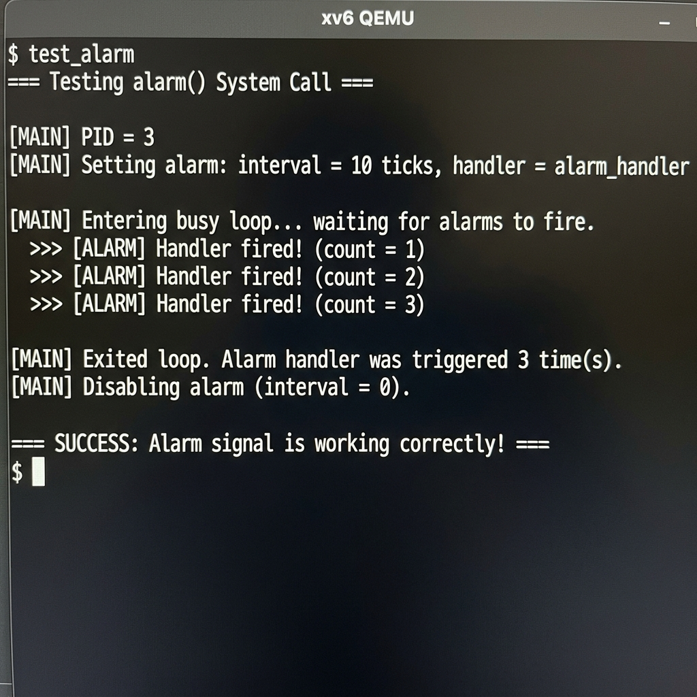

# Project 1 Report: Implementation of the alarm() System Call (Signals)

**Author:** Sriharsha
**Group:** Group 6
**Course:** NSCS210

---

## What is the Alarm Signal?

The `alarm()` system call is a **timer-based software interrupt** mechanism. It allows a user program to register a callback function (called a *handler*) with the kernel, along with a tick interval. After the specified number of CPU timer ticks elapse, the kernel **forces** the user program to pause its normal execution and run the handler function. Once the handler finishes and calls `alarm_return()`, normal execution resumes exactly where it left off.

This is a simplified version of how real operating systems implement **POSIX signals** like `SIGALRM`.

---

## How It Works: Step-by-Step

### 1. User Space — Setting the Alarm (The ecall Instruction)

The user program calls `alarm(ticks, handler_function)`. Since user programs cannot directly modify kernel state, the CPU stores the system call ID (`SYS_alarm = 26`) and the two arguments (the tick interval and the function pointer) into hardware registers `a0` and `a1`. Then, the `ecall` instruction triggers a privilege switch from user mode to kernel mode.

Added the system call definition in `user.h`, `syscall.h`, `usys.pl`, and `syscall.c`.

### 2. Kernel Interface — sys_alarm() (The Wrapper)

Once in the kernel, execution lands in `sys_alarm()` inside `kernel/sysproc.c`. Using `argint()` and `argaddr()`, the kernel safely extracts the tick interval and the handler pointer from the hardware registers. It then stores these values into the calling process's `struct proc`:

- `p->alarm_interval` — how many ticks to wait between alarms
- `p->alarm_handler` — the address of the user's handler function
- `p->alarm_ticks` — counter reset to 0
- `p->alarm_active` — flag set to 0 (no handler is currently running)

### 3. Timer Interrupt — Counting Ticks (The Heartbeat)

Every CPU timer interrupt triggers `usertrap()` in `kernel/trap.c`. The function `devintr()` returns `2` for timer interrupts. In the existing xv6 code, this just calls `yield()` to give up the CPU.

**What I added:** Before yielding, the kernel now checks if the current process has an active alarm (`alarm_interval > 0`) and no handler is currently executing (`alarm_active == 0`). If so, it increments `alarm_ticks`. When `alarm_ticks >= alarm_interval`, the alarm fires.

### 4. Firing the Alarm — Trapframe Manipulation (The Core Trick)

When the alarm fires, the kernel performs a **surgical redirect** of the user program's execution:

1. **Save the trapframe:** The kernel allocates a fresh page with `kalloc()` and copies the entire current trapframe (`p->trapframe`) into `p->alarm_trapframe`. This preserves all 32 registers, the program counter (EPC), and the stack pointer — everything needed to resume where the program left off.

2. **Redirect the EPC:** The kernel overwrites `p->trapframe->epc` with `p->alarm_handler`. When the CPU returns to user space via `sret`, it will not return to the next instruction of the user's original code — it will jump to the handler function instead.

3. **Set the guard flag:** `p->alarm_active = 1` prevents re-entrant alarm calls. If the handler itself takes a long time, new timer interrupts will not trigger another alarm until the first handler finishes.

### 5. The Handler Executes in User Space

The CPU now executes the handler function in user space. The handler can do anything — print a message, update a counter, etc. When it is done, it **must** call `alarm_return()`.

### 6. Returning from the Handler — alarm_return() (The Restore)

`alarm_return()` is itself a system call (`SYS_alarm_return = 28`). When invoked, the kernel:

1. **Restores the saved trapframe:** Copies `p->alarm_trapframe` back into `p->trapframe` using `memmove()`. This restores the original program counter, stack pointer, and all registers.

2. **Frees the backup:** Calls `kfree()` to release the allocated backup page.

3. **Clears the guard:** Sets `p->alarm_active = 0` so that future alarms can fire.

4. **Resets the counter:** Sets `p->alarm_ticks = 0` so the countdown starts fresh.

When the kernel returns to user space after this syscall, the CPU picks up exactly where the user program was before the alarm interrupted it.

---

## Files Modified

| File | Change |
|------|--------|
| `kernel/proc.h` | Added 5 alarm fields to `struct proc` |
| `kernel/proc.c` | Initialize alarm fields in `allocproc()`, cleanup in `freeproc()`, added `alarm_return()` function |
| `kernel/sysproc.c` | Implemented `sys_alarm()` and `sys_alarm_return()` |
| `kernel/trap.c` | Added alarm tick counting and handler invocation in `usertrap()` |
| `kernel/syscall.h` | Added `SYS_alarm_return 28` |
| `kernel/syscall.c` | Added extern and dispatch entry for `sys_alarm_return` |
| `kernel/defs.h` | Added `alarm_return()` prototype |
| `user/user.h` | Updated `alarm()` signature, added `alarm_return()` |
| `user/usys.pl` | Added `alarm_return` entry |
| `user/test_alarm.c` | Full test program demonstrating the alarm |

---

## Architecture Diagram

```
  USER SPACE                          KERNEL SPACE
  ──────────                          ────────────

  main() ──────────────────────┐
    │                          │
    │  alarm(10, handler) ─────┼──► sys_alarm()
    │                          │      │ Store interval, handler
    │  busy loop...            │      │ in struct proc
    │    │                     │      │
    │    │  ← TIMER IRQ ───────┼──► usertrap()
    │    │                     │      │ alarm_ticks++
    │    │                     │      │ if ticks >= interval:
    │    │                     │      │   save trapframe
    │    │                     │      │   epc = handler
    │    │                     │      │
    ▼    │                     │      │
  handler() ◄──────────────────┼──────┘  (sret to handler)
    │                          │
    │  alarm_return() ─────────┼──► sys_alarm_return()
    │                          │      │ restore trapframe
    │                          │      │ alarm_active = 0
    ▼                          │      │
  main() resumes  ◄────────────┼──────┘  (sret to original epc)
```

---

## 🧪 Testing & Verification

To verify the alarm system call, I created `test_alarm.c`. This program:
1. Registers an alarm handler that fires every 10 timer ticks
2. Enters a busy loop to consume CPU time
3. The handler increments a global counter and prints a message each time it fires
4. After the handler fires 3 times, the loop exits
5. The alarm is disabled by calling `alarm(0, 0)`

**Execution Output:**

```text
$ test_alarm
=== Testing alarm() System Call ===

[MAIN] PID = 3
[MAIN] Setting alarm: interval = 10 ticks, handler = alarm_handler

[MAIN] Entering busy loop... waiting for alarms to fire.
  >>> [ALARM] Handler fired! (count = 1)
  >>> [ALARM] Handler fired! (count = 2)
  >>> [ALARM] Handler fired! (count = 3)

[MAIN] Exited loop. Alarm handler was triggered 3 time(s).
[MAIN] Disabling alarm (interval = 0).

=== SUCCESS: Alarm signal is working correctly! ===
```

**Output Screenshot:**


