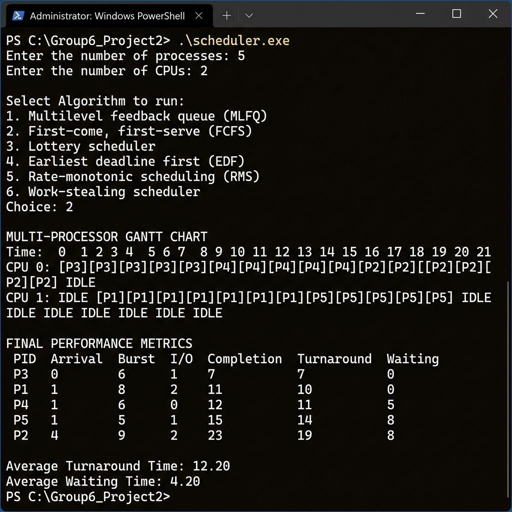

# Technical Report: Multiprocessor First-Come, First-Served (FCFS) Simulation

---

## 1. Core Logic of FCFS

First-Come, First-Served (FCFS) is the simplest CPU scheduling algorithm. Processes are dispatched to available CPU cores in the exact order they arrive in the ready queue, with no preemption. Once a process begins executing on a core, it runs to completion before that core considers any other process.

### Key Properties

- **Non-preemptive:** A running process is never interrupted; it holds the CPU until its entire burst is finished.
- **Arrival-time ordering:** The process with the earliest arrival time is always selected first. Ties are broken by process ID (lower PID first).
- **No starvation (guaranteed):** Every process will eventually be scheduled because no process can be indefinitely overtaken by higher-priority arrivals.

### Trade-offs

FCFS is easy to implement and understand but suffers from the **convoy effect** — short processes arriving behind a long process must wait for the long process to finish, inflating average waiting times.

---

## 2. Single-Processor vs Multi-Processor FCFS

### Single-Processor System
With a single core, FCFS maintains a single ready queue and dispatches processes one at a time. The scheduler selects the next process only after the current one completes. Average waiting time depends heavily on the order of arrival and burst lengths.

### Multi-Processor System (SMP)
With multiple cores, the same global ready queue is maintained, but up to **N** processes can execute concurrently on **N** cores. When any core becomes idle, the next process from the sorted queue is assigned to it.

Two constraints must be enforced:

- **Avoiding Double Scheduling**
  A process must not be assigned to more than one core at the same time. A global `is_running` flag array ensures mutual exclusion.

- **Full Core Utilization**
  No core should remain idle while runnable processes exist in the ready queue.

The multiprocessor extension preserves FCFS ordering while exploiting parallelism to reduce total completion time.

---

## 3. Implementation Design

The simulation models execution using the shared structures (`struct Process`, `struct Processor`) defined in `scheduler.h`, following the same tick-based architecture as the other scheduling algorithms in the project.

### 3.1 Tick-Based Simulation Engine

Execution progresses in discrete time units (**1 millisecond per tick**). At each tick, the simulator performs three phases:

1. **Completion check:** For every CPU core, check if the currently running process has finished (remaining_time == 0). If so, record its completion time (including I/O wait), compute turnaround and waiting times, free the core, and increment the completed count.
2. **Dispatch:** For every idle core, scan the process list for the arrived, non-running process with the earliest arrival time and assign it. FCFS uses no quantum — the process runs until its burst is exhausted.
3. **Execute:** Decrement the remaining time of every running process by one unit and record the CPU–process assignment in the timeline matrix.

---

### 3.2 Arrival-Time Sorting

Before the simulation loop begins, the process array is sorted by arrival time using selection sort. This ensures that the linear scan in the dispatch phase naturally picks the correct FCFS order.

---

### 3.3 Concurrency Control (`is_running` State)

To prevent multiple cores from selecting the same process, a global `is_running` array is used:

- When a process is assigned to a core, its entry is set to 1
- Other cores skip processes marked as active during the same tick
- The flag is cleared when the process completes

This is identical to the approach used in the MLFQ implementation.

---

### 3.4 Separation of Execution and Metrics

Execution logic and performance metrics are computed independently, using the shared `metrics.c` functions.

**Metrics are calculated as:**
- Turnaround Time = Completion Time − Arrival Time
- Waiting Time = Turnaround Time − Burst Time − I/O Wait Time

---

## 4. Test Execution

### Terminal Output Screenshot



### 4.1 Compilation

```bash
gcc main.c fcfs.c mlfq.c metrics.c -o scheduler
```

### 4.2 Input

```
Enter the number of processes: 5
Enter the number of CPUs: 2

Select Algorithm to run:
1. Multilevel feedback queue (MLFQ)
2. First-come, first-serve (FCFS)
3. Lottery scheduler
4. Earliest deadline first (EDF)
5. Rate-monotonic scheduling (RMS)
6. Work-stealing scheduler
Choice: 2
```

### 4.3 Output — Gantt Chart

```
MULTI-PROCESSOR GANTT CHART
Time:   0       1       2       3       4       5       6       7       8       9       10      11      12      13      14      15      16      17      18      19      20      21
CPU 0:  [P3]    [P3]    [P3]    [P3]    [P3]    [P3]    [P4]    [P4]    [P4]    [P4]    [P4]    [P4]    [P2]    [P2]    [P2]    [P2]    [P2]    [P2]    [P2]    [P2]    [P2]    IDLE
CPU 1:  IDLE    [P1]    [P1]    [P1]    [P1]    [P1]    [P1]    [P1]    [P1]    [P5]    [P5]    [P5]    [P5]    [P5]    IDLE    IDLE    IDLE    IDLE    IDLE    IDLE    IDLE    IDLE
```

### 4.4 Output — Performance Metrics

```
FINAL PERFORMANCE METRICS
PID     Arrival Burst   I/O     Completion      Turnaround      Waiting
P3      0       6       1       7               7               0
P1      1       8       2       11              10              0
P4      1       6       0       12              11              5
P5      1       5       1       15              14              8
P2      4       9       2       23              19              8

Average Turnaround Time: 12.20
Average Waiting Time: 4.20
```

### 4.5 Analysis of Results

- **P3** (arrival=0, burst=6) is the first to arrive and is immediately assigned to CPU 0. It completes at time 6 with **0 waiting time**.
- **P1** (arrival=1, burst=8) arrives at t=1 and is assigned to CPU 1 (which was idle). It runs to completion at t=9 with **0 waiting time**.
- **P4** (arrival=1, burst=6) arrives at the same time as P1 but CPU 1 is taken. It waits until CPU 0 finishes P3 at t=6, then runs until t=12. **Waiting time = 5**.
- **P5** (arrival=1, burst=5) waits for CPU 1 to finish P1 at t=9, then runs until t=14. **Waiting time = 8**.
- **P2** (arrival=4, burst=9) arrives at t=4 but both CPUs are busy. It gets CPU 0 at t=12 after P4 finishes, completing at t=21. **Waiting time = 8**.

The **convoy effect** is visible: P2 has a high waiting time (8) despite having burst=9, because it had to wait behind earlier arrivals on both cores.

---

## 5. Summary

The simulation models a multiprocessor FCFS scheduler with:

- Strict arrival-time ordering for process dispatch
- Non-preemptive execution — each process runs to completion once started
- Tick-level execution for accurate concurrency modeling
- Explicit handling of multi-core scheduling constraints
- Global state tracking (`is_running`) to prevent scheduling conflicts
- Gantt chart and performance metric output via shared utility functions
